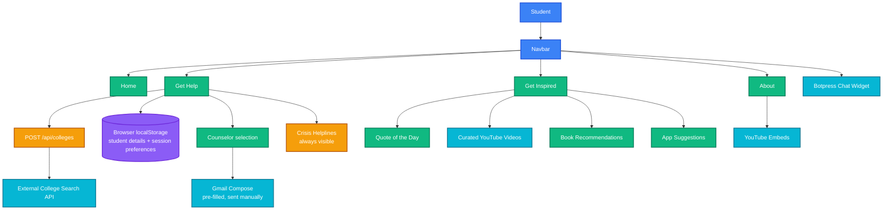
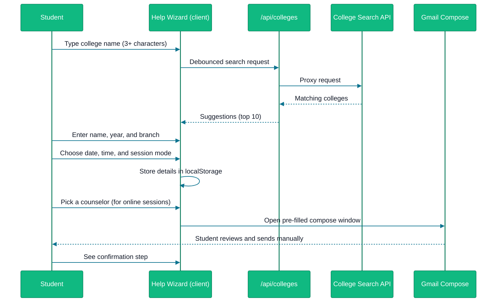

<div align="center">

# MIND CARE

### A student well-being platform connecting students to guidance, resources, and support

Mind Care helps students navigate exam pressure, career confusion, and everyday overwhelm. It
gives students a guided path to reach a counselor, curated resources to feel better in the
moment, and always-visible crisis helplines — all without requiring an account.

[Live Demo](https://mindcare7.netlify.app/) &nbsp;•&nbsp; [Report Bug](https://github.com/AaryaMakthala/MIND-CARE/issues) &nbsp;•&nbsp; [Request Feature](https://github.com/AaryaMakthala/MIND-CARE/issues)

<br/>


</div>

---

## Table of Contents

- [Overview](#overview)
- [System Architecture](#system-architecture)
- [Get Help Flow](#get-help-flow)
- [Key Features](#key-features)
- [Technology Stack](#technology-stack)
- [API Reference](#api-reference)
- [Project Structure](#project-structure)
- [Getting Started Locally](#getting-started-locally)
- [Deployment](#deployment)
- [License](#license)

---

## Overview

Mind Care is built around three things a student can use immediately, with no sign-up required:

- **A guided Get Help wizard** that walks a student from finding their college to reaching a
  counselor, ending in a ready-to-send email.
- **A resource hub** — Get Inspired — with a daily quote, curated videos, books, and apps for
  students looking for something lighter.
- **Always-visible crisis helplines**, shown on the Get Help page regardless of where a student
  is in the flow.

The site is fully static and client-driven where it counts: there is no account system to sign
up for and nothing a student needs to remember or log back into. Every page is reachable
directly from the navigation bar.

---

## System Architecture



---

## Get Help Flow



The wizard never stores a booking on a server — the final step hands the student a ready-to-send
email rather than submitting a request automatically. This keeps the flow simple and fully
client-side, with no backend to fail.

---

## Key Features

### Get Help Wizard
A five-step flow with no login required:

1. Search for a college by name, with live autocomplete
2. Enter student details — name, year, and branch
3. Choose a session date, time, and mode (offline or online)
4. For online sessions, pick from a curated list of counselors
5. Review a confirmation screen after sending a pre-filled email to the chosen counselor

### Crisis Helplines
Helpline numbers are shown on the Get Help page at all times, independent of anything else on
the page:

- KIRAN — 1800-599-0019
- AASRA — +91-9820466726
- Vandrevala Foundation — +91 9999 666 555
- iCall (TISS)

All four are described as available 24/7.

### Get Inspired
A resource hub for students who want something lighter than a formal counseling path:

- A rotating quote of the day
- Curated YouTube videos
- Book recommendations
- Suggested apps for mental well-being

### About
Static context on the problem Mind Care addresses — exam pressure, career confusion, family
expectations, and late-night overwhelm — along with supporting video content.

### Chat Widget
A Botpress-powered chat widget is available site-wide for students who want to ask a question
directly.

---

## Technology Stack

<table>
<tr>
<td valign="top" width="50%">

**Frontend**


</td>
<td valign="top" width="50%">

**Integrations**


</td>
</tr>
<tr>
<td valign="top" width="50%">

**Deployment**


</td>
<td valign="top" width="50%">

</td>
</tr>
</table>

| Technology | Role in the project |
|---|---|
| Next.js 15.5 (App Router) | Frontend framework, routing, and the college-search API route |
| React 18.3 | UI components |
| Tailwind CSS 3.4 | Styling |
| External College Search API | Powers live autocomplete in the Get Help wizard |
| Gmail Compose | Hands off the completed booking request to the student for sending |
| Botpress | Site-wide chat widget |
| Netlify | Hosting and serverless functions for API routes |

---

## API Reference

| Method | Route | Purpose | Auth |
|---|---|---|---|
| `POST` | `/api/colleges` | Proxies a search query to an external college database and returns matching college names | None |

This is the only backend endpoint the live product depends on. Requests under three characters
return an empty result immediately, and any upstream failure returns an empty list so the
wizard can show a graceful "no college found" state.

---

## Project Structure

```
mind-care/
├── app/
│   ├── layout.js               # Root layout: Navbar + Botpress widget
│   ├── page.jsx                 # Home
│   ├── about/                    # About page + video embeds
│   ├── help/                      # Get Help wizard
│   ├── inspired/                   # Get Inspired: quotes, videos, books, apps
│   ├── contents/Navbar.js           # Site navigation
│   └── api/
│       └── colleges/route.js         # College search proxy
└── public/                             # Static assets
```

---

## Getting Started Locally

### Prerequisites

- Node.js 18 or later
- npm or yarn

### Setup

```bash
git clone https://github.com/AaryaMakthala/MIND-CARE.git
cd MIND-CARE
npm install
npm run dev
```

The site runs at `http://localhost:3000`. No environment variables or database are required to
run the site as documented here.

---

## Deployment

The site is deployed on Netlify at [mindcare7.netlify.app](https://mindcare7.netlify.app/),
using `@netlify/plugin-nextjs` to run the college-search API route as a serverless function.

---

## License

This project does not currently declare a license. Add a license file if you intend to
distribute or open-source this project.

---

<div align="center">

Built by [Aarya Makthala](https://github.com/AaryaMakthala)

</div>
